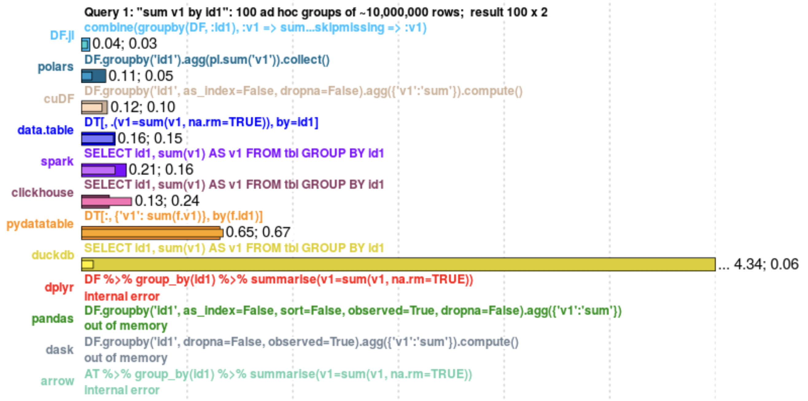

# MLOps関連ツール

> **Note**
> 当文書は[MLOps Tools](https://github.com/chiphuyen/dmls-book/blob/main/mlops-tools.md)を日本語に翻訳したものです。

ツールとは儚いもので、あらゆるソフトウェアはいずれ時代遅れになってしまうので、本書の中ではツールについて解説することは控えました。ただし、要点の説明の役に立つ場合には本書の中でもツールに言及している箇所があります。初期の読者の皆さんから、本書のおかげで便利なツールを見つけることができたという声や、お勧めのツールをもっと教えてほしいという声を頂きましたので、ここで紹介してみようと思います。

当文書では、まずはじめに他の方がまとめてくださった膨大なツールのリストを掲載し、その後に私が特にお勧めしたいツールを簡単にいくつか掲載します。リストが長くなり過ぎないようにデータサイエンスのコミュニティで既によく知られているツールは割愛しています。新たなお勧めのツールがあれば、お気軽にissueを起票、またはプルリクエストをお送りください。ありがとうございます。

また、MLOpsのDiscordのチャンネル（[#tools-watch](https://discord.gg/Mw77HPrgjF)）でも興味深いツールについての議論が交わされています。

* [MLOps関連ツールのリスト（多め）](#MLOps関連ツールのリスト（多め）)
* [MLOps関連のオープンソースツールのリスト（少なめ）](#MLOps関連のオープンソースツールのリスト（少なめ）)
    * [Pandasの代替ツール](#Pandasの代替ツール)
    * [データ・特徴](#データ・特徴)
    * [説明能力（解釈可能性）と公正さ](#説明能力（解釈可能性）と公正さ)
    * [モデルのデプロイと評価](#モデルのデプロイと評価)
    * [ユースケースに特化したフレームワーク](#ユースケースに特化したフレームワーク)
    * [開発環境](#開発環境)
    * [MLOps向けのDevOps](#MLOps向けのDevOps)

# MLOps関連ツールのリスト（多め）

言うまでもなくMLOps関連のツールは山のように存在しています。多数のツールを掲載したリストが既にいくつも存在するので、ここで新たにリストを作成するつもりはありません。膨大なツールのリストを見たい場合は、次のような情報源が有名です。

> **Warning**
> * このリストの多くはベンダーが後援するコミュニティによって作成されています。スポンサーを得ることに問題はありません。コミュニティ運営にもコストがかかりますから、スポンサーを得ることができるコミュニティは賞賛に値します。しかしながら、ベンダーのスポンサーシップとレビューのベンダー中立性との間で利害が対立することもあるでしょう。
> * ツールをカテゴリーに分けて機能で評価していますが、状況の変化が激しいためカテゴリがまだはっきりと定まっているわけではありません。同様にベストプラクティスについても過渡期にあり、企業にとってどの機能が自分たちに必要かを判断することが難しくなっています。

1. [MLOps Community’s Learn](https://mlops.community/learn/): 現時点で、特徴ストア、監視、メタデータストレージと管理ツール（モデルストアも含む）の3つのカテゴリで構成されており、新たにデプロイのカテゴリが追加されようとしているところです。ツールを複数選択して比較検討することができます。
2. [TwiML Solutions Guide](https://twimlai.com/solutions/): サポートする機能やデプロイ可能な場所に応じてカテゴリ別にツールがグループ化されています
3. [StackShare](https://stackshare.io/): 様々な開発ツールを閲覧でき、そのツールを採用している企業や、言及している採用情報を確認できます。代替ツールをチェックしたりレビューを読んだりすることもできます。また、有名なテック系企業の技術スタックを見ることもできますし、複数のツールを比較検討することもできます。私が思うに、StackShareは多くのMLOpsソリューションガイドが目指しているものですが、StackShareはMLOpsだけでなく、あらゆる技術スタックに対応しています。
4. [AI Infrastructure Landscape](https://ai-infrastructure.org/ai-infrastructure-landscape/): AIインフラにフォーカスしたメンバーシップ制の団体（オープンソースにフォーカスした[LFAI & Data](https://lfaidata.foundation/)よりも一般的）で、MLOpsツールに関する包括的な調査と分析を多数手がけています。
5. Matt Turckが毎年発表している[Machine Learning, AI and Data (MAD) Landscape](https://mattturck.com/data2021/): 投資家の観点からのハイレベルな分析です。
6. Leigh Marie Braswellの[Startup Opportunities in Machine Learning Infrastructure](https://leighmariebraswell.substack.com/p/startup-opportunities-in-machine): 別の投資家の視点からMLOpsの展望のギャップを分析したものです。
7. こちらは私が作成した[MLOps Landscape](https://huyenchip.com/2020/12/30/mlops-v2.html)です。284のツールをリストアップした[Googleスプレッドシート](https://docs.google.com/spreadsheets/d/1i8BzE4puGQ3dmQueu4LQCcwaqrulgK1Vb-xeFwhy6gY/edit#gid=0)（最終更新日：2020年12月）と、これをインタラクティブに可視化したものです。膨大な手間がかかることと他にも同じようなことに取り組んでいる人々がいるため、このリストをメンテナンスするのを止めました。

# MLOps関連のオープンソースツールのリスト（少なめ）

私はイケてるオープンソースツールを見つけるたびにスターを付けています。[こちら](https://github.com/chiphuyen?tab=stars)で全リストをチェックできます。

**免責**: このリストがすべてのツールを網羅できているわけではありません。

## Pandasの代替ツール

PandasのDataFrameなどの表形式はデータの操作に最適です。しかしPandasは[遅く](https://stackoverflow.com/search?q=%5Bpandas%5D+slow)、[癖があり](https://github.com/chiphuyen/just-pandas-things)、GPUをうまく活用できません。当然ながら、これらの問題を解決しようとするプロジェクトが数多く存在します。そのいくつかを以下に紹介します。

* [modin](https://github.com/modin-project/modin): `import pandas as pd`の代わりに`import modin.pandas as pd`を使ってPandasを簡単に置き換えられます。[Ponder](https://ponder.io/)はこれをベースにエンタープライズ版の開発に取り組んでいます。
* [dask](https://github.com/dask/dask)・[cuDF](https://github.com/rapidsai/cudf): daskの主要な開発者がNVIDIAを離れて[Coiled](https://coiled.io/)を立ち上げるまでは、いずれのプロジェクトもNVIDIAのRAPIDS AIチームによってメンテナンスされていました。[Coiled](https://coiled.io/)はdaskをベースにしたエンタープライズ版です。
* [Polars](https://github.com/pola-rs/polars/): PolarsはApache Arrow上にRustで構築されており、高速なことがウリです。

H2Oは面白い[データベース風のopsベンチマーク](https://h2oai.github.io/db-benchmark/)を実現しています（願わくばグラフの配色を再検討してほしいものですが）。

## データ・特徴

* オンライン分析データベース（予測とユーザーフィードバックを組み合わせてリアルタイムでモデルのパフォーマンスを監視したい場合など）: [ClickHouse](https://github.com/ClickHouse/ClickHouse)、[Druid](https://github.com/apache/druid)。
* ストリーミング処理: [ksql](https://github.com/confluentinc/ksql)、[faust](https://github.com/robinhood/faust)、[materialize](https://github.com/MaterializeInc/materialize)、[Redpanda](https://github.com/redpanda-data/redpanda) (WASM上)
* 可視化: [D3](https://github.com/d3/d3)、[Superset](https://github.com/apache/superset)、[Facets](https://github.com/PAIR-code/facets)、 [redash](https://github.com/getredash/redash)、[visdom](https://github.com/fossasia/visdom)、[plotly](https://github.com/plotly/plotly.py), [Altair](https://github.com/altair-viz/altair)、[pandas-profiling](https://github.com/ydataai/pandas-profiling)、[lux](https://github.com/lux-org/lux) (DataFrames用のみ)、[bokeh](https://github.com/bokeh/bokeh)
* データ検証: : [Great Expectations](https://github.com/great-expectations/great_expectations)、[deepchecks](https://github.com/deepchecks/deepchecks)、[pandera](https://github.com/pandera-dev/pandera)
* ラベル付け: [Snorkel](https://github.com/snorkel-team/snorkel)、[Label Studio](https://github.com/heartexlabs/label-studio)、[doccano](https://github.com/doccano/doccano)
* データのバージョン管理: [DVC](https://github.com/iterative/dvc)、[Dolt](https://github.com/dolthub/dolt)、[pachyderm](https://github.com/pachyderm/pachyderm)
* 非構造化データのホスティング: [Hub](https://github.com/activeloopai/Hub)
* メタデータストア（特徴を探す用途で）: Lyftの[Amundsen](https://github.com/amundsen-io/amundsen)やLinkedInの[DataHub](https://github.com/datahub-project/datahub)。
* 特徴ストア: [FEAST](https://github.com/feast-dev/feast)（OSS）。FEASTベースで構築されている商用の特徴ストアもあります。
* データパイプライン: [ploomber](https://github.com/ploomber/ploomber)、[hamilton](https://github.com/stitchfix/hamilton)、[NVTabular](https://github.com/NVIDIA-Merlin/NVTabular)
* 全体的に[arrow](https://github.com/apache/arrow)と[flight](https://arrow.apache.org/blog/2019/10/13/introducing-arrow-flight/)のエコシステムが急速に成長しています。

## 説明能力（解釈可能性）と公正さ

* 説明能力（解釈可能性）: [SHAP](https://github.com/slundberg/shap)、[Lime](https://github.com/marcotcr/lime)、[Interpret](https://github.com/interpretml/interpret)、[lit](https://github.com/PAIR-code/lit)（NLP向け）、[captum](https://github.com/pytorch/captum) （PyTorch)）、[timeshap](https://github.com/feedzai/timeshap)、[AIX360](https://github.com/Trusted-AI/AIX360)
* 公正さ: [AIF360](https://github.com/Trusted-AI/AIF360)

## モデルのデプロイと評価

* 実験管理: [MLflow](https://github.com/mlflow/mlflow)、[aim](https://github.com/aimhubio/aim)。当カテゴリのツールの大半はオープンソースではありません。理由は成果物をホストして可視化する難易度が高いためです。
* モデル最適化: [TVM](https://github.com/apache/tvm)、[TensorRT](https://developer.nvidia.com/tensorrt)、[Triton](https://github.com/openai/triton)、[hummingbird](https://github.com/microsoft/hummingbird)、[composer](https://github.com/mosaicml/composer)
* 分散訓練: [DeepSpeed](https://github.com/microsoft/DeepSpeed)（超いいです）, [accelerate](https://github.com/huggingface/accelerate)
* 連合学習（Federated learning）: [PySyft](https://github.com/OpenMined/PySyft)、[FedML](https://github.com/FedML-AI/FedML)、[FATE](https://github.com/FederatedAI/FATE)、[TensorFlow Federated](https://www.tensorflow.org/federated)
* 評価: [checklist](https://github.com/marcotcr/checklist)（NLP）、[reclist](https://github.com/jacopotagliabue/reclist)（レコメンドシステム）
* オンライン実験（A/Bテストなど）: [growthbook](https://github.com/growthbook/growthbook)、[Ax](https://github.com/facebook/Ax)

## ユースケースに特化したフレームワーク

ただ私が個人的に興味があるユースケースを採り上げているだけです。あまり気にしないでください。

* ニューラルレコメンドシステム/CTR: [DLRM](https://github.com/facebookresearch/dlrm)、[DeepCTR](https://github.com/shenweichen/DeepCTR), [tensorflow-DeepFM](https://github.com/ChenglongChen/tensorflow-DeepFM)、[Transformers4Rec](https://github.com/NVIDIA-Merlin/Transformers4Rec)
* 対話型AI: [rasa](https://github.com/RasaHQ/rasa)、[NeMo](https://github.com/NVIDIA/NeMo)
* 類似検索: [annoy](https://github.com/spotify/annoy), [Faiss](https://github.com/facebookresearch/faiss), [Milvus](https://github.com/milvus-io/milvus)
* Deepfake: [faceswap](https://github.com/deepfakes/faceswap)、[deepface](https://github.com/serengil/deepface)
* タイムラグコンバージョンモデリング: [convoys](https://github.com/better/convoys)
* チャーン予測: [WTTE-RNN](WTTE-RNN)
* 生存分析（Survival analysis）: [lifelines](https://github.com/CamDavidsonPilon/lifelines)

## 開発環境

* CLIツール: [fzf](https://github.com/junegunn/fzf) (fuzzy search)、[lipgloss](https://github.com/charmbracelet/lipgloss)
* IDE: VSCodeを使いましょう（ノートブックもとても素晴らしいです）
* 依存関係の管理: [Poetry](https://github.com/python-poetry/poetry)
* 設定の管理: [Hydra](https://github.com/facebookresearch/hydra)、[gin-config](https://github.com/google/gin-config)
* ドキュメンテーション: [docusaurus](https://github.com/facebook/docusaurus)
* Kubernetesでのデバッグ: [k9s](https://github.com/derailed/k9s)
* 仮想ホワイトボード: [excalidraw](https://github.com/excalidraw/excalidraw)

## MLOps向けのDevOps

* CI/CD: [earthly](https://github.com/earthly/earthly)
* 監視: [Sentry](https://github.com/getsentry/sentry)、[Prometheus](https://github.com/prometheus/prometheus)、[vector](https://github.com/vectordotdev/vector)、[M3](https://github.com/m3db/m3)
* ダッシュボード: [Grafana](https://github.com/grafana/grafana)、[Metabase](https://github.com/metabase/metabase)
* DevOps全般: [Chaos Monkey](https://github.com/Netflix/chaosmonkey)、[k6](https://github.com/grafana/k6)
